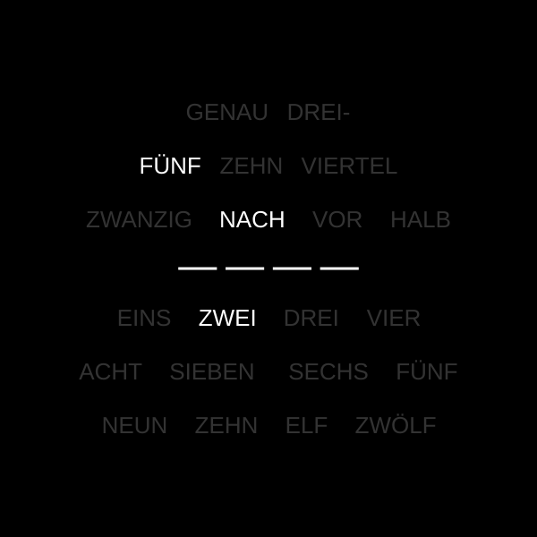
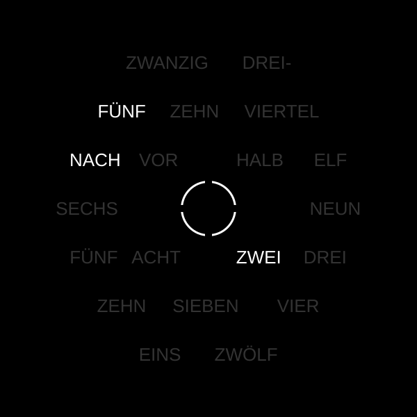
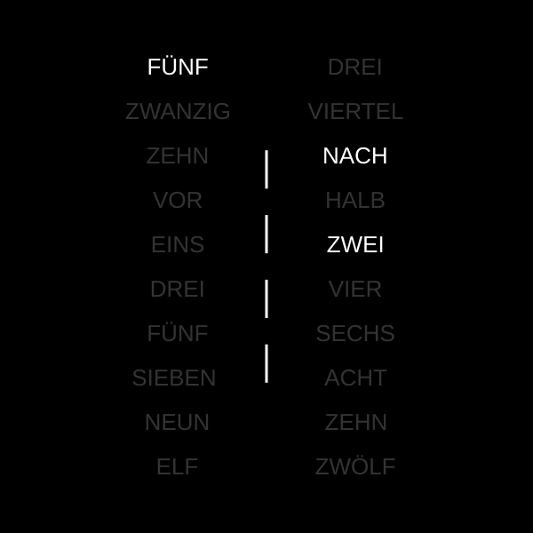

# Wortuhr

**Another word clock**

A clock that spells the time out in German words, lit through a laser-cut
front plate by a chain of 25 addressable LEDs. It runs [ESPHome](https://esphome.io)
on an ESP32-C3 and reports to Home Assistant over the native API and MQTT.

Four dialects are switchable at runtime: **Hochdeutsch**, **Bayrisch**,
**Sächsisch** and **Schwäbisch**. They disagree about the quarters — the same
14:45 reads `VIERTEL VOR ZWEI` in one and `DREIVIERTEL ZWEI` in another.

[](https://github.com/carsten-walther/wortuhr/issues)
[](https://github.com/carsten-walther/wortuhr/network/members)
[](https://github.com/carsten-walther/wortuhr/stargazers)
[](https://github.com/carsten-walther/wortuhr/releases/latest)
[](LICENSE)
[](https://github.com/carsten-walther/wortuhr/releases/latest)

|  _Image: Wortuhr Plate Model INES_ |  _Image: Wortuhr Plate Model NINA_ |  _Image: Wortuhr Plate Model MARIA_ |
|:---:|:---:|:---:|

A detailed [**build**](docs/BUILD.md) and [**operation**](docs/README.md) manual
can be found in the [**docs**](docs) folder. Front plates and light grids
live in [**builds**](builds).

---

## Which plate this firmware matches

Three front plates are in this repository, and they are not interchangeable as
far as the firmware is concerned:

| Plate | Words | LEDs | Has `GENAU` | Matches `wortuhr.yaml` |
|---|--:|--:|:---:|:---:|
| INES | 21 | **25** | yes | **yes** |
| NINA | 20 | 24 | no | no |
| MARIA | 20 | 24 | no | no |

`wortuhr.yaml` is written for **INES**: `NUMBER_OF_LEDS: 25`, and the LED map at
the top of the `Time` effect names 9 minute words, 4 minute dots and 12 hour
words in the order INES is wired in.

NINA and MARIA are 24 LEDs, have no `GENAU`, and put their words in a different
order. Driving one of them means editing the constant block in the effect and
the LED count together — not just the count.

---

## Hardware

| Amount | Item | Notes |
|--:|---|---|
| 1 | ESP32-C3 DevKitM-1 | Any C3 board works, `board:` may need changing |
| 25 | WS2811 addressable LEDs | One per word and minute dot, INES layout |
| 1 | DS1307 RTC module | I²C, address `0x68`, with its own coin cell |
| 1 | 5 V power supply | Sized for the strip, see below |
| 1 | Image frame 20×20 cm | e.g. IKEA Ribba |

### Wiring

```
ESP32-C3 DevKitM-1        WS2811 chain          DS1307 module
──────────────────        ────────────          ─────────────
GPIO10 ────────────────── DIN
GPIO8  ─────────────────────────────────────────  SDA
GPIO9  ─────────────────────────────────────────  SCL
3V3    ─────────────────────────────────────────  VCC
GND    ────────────────── GND ──────────────────  GND
5V ────────────────────── +5V
```

`GPIO8` and `GPIO9` are strapping pins on the ESP32-C3 — ESPHome warns about
them on every build. They work here only because the DS1307 breakout's own
pull-ups hold them high while the chip comes out of reset. A pull-down on
either one boots into the ROM bootloader instead of into the firmware.

The strip runs on 5 V while the ESP drives the data line at 3.3 V. A WS2811
reads a logic high above 0.7 × VDD, which is 3.5 V — so 3.3 V is marginally out
of spec. It works on most batches and not on others. **If the first LED
flickers or shows a wrong colour while the rest of the chain is fine, that is
this**, and a level shifter on the data line fixes it.

---

## Installation

Needs a `secrets.yaml` next to the config with:

```yaml
wifi_ssid: "..."
wifi_password: "..."
wifi_ap_password: "..."     # fallback AP, at least 8 characters
api_encryption_key: "..."   # base64, 32 bytes
ota_password: "..."
mqtt_broker: "..."
mqtt_username: "..."
mqtt_password: "..."
web_username: "..."         # web interface login
web_password: "..."
```

Then:

```sh
esphome run wortuhr.yaml
```

First flash over USB, everything after that over the air.

---

## Entities

### Control

| Entity | Type | Does |
|---|---|---|
| LED Color | light | The panel. Colour, brightness and effect |
| Mode | select | Dialect: Hochdeutsch, Bayrisch, Sächsisch, Schwäbisch |

The light carries six effects. **Time** is the clock and the one it runs on.
`Rainbow` is what the boot sequence puts up while the network comes up, and
`Color Wipe` walks the chain one LED at a time, which is how a dead one gets
found. `Fireworks`, `Twinkle` and `Random Twinkle` are decoration.

`gamma_correct` is `1.0` rather than the default `2.8` because of those last
three: they fade pixels in and out, and a gamma curve applied on top of a
fade crushes its dark end into black. The side effect is on the brightness
slider — at `1.0` a setting of 70 % drives the LEDs at 70 %, not at the ~37 %
that `0.7^2.8` works out to, so the panel reads brighter than it used to at
the same number.

Switching the panel on without asking for anything lands on `Time`, so a
decoration cannot be left running by accident. Asking for an effect as part of
the switch-on keeps it — the trigger only normalises a switch-on that specified
nothing.

### Diagnostic

`ESPHome Version`, `Firmware Version`, `SSID`, `IP Address`, `DNS Address`,
`Device Uptime`, `Reset Reason`, `Reset Count`, `Heap Free`,
`Heap Largest Block`, `WiFi Signal (dBm)`, `WiFi Signal (%)`,
`Connection Status`.

`Reset Count` is a persisted counter, incremented once per boot. It answers
what `Reset Reason` cannot: that a restart happened at all while nobody was
looking. A rising count against a low `Device Uptime` is the signature of a
device rebooting in a loop. A factory reset clears it.

`Reset Count`, `Reset Reason` and `Firmware Version` are **pushed once at boot**
rather than polled. None of the three can change while the device is up — the
counter is incremented during startup, the version is compiled in, and
`esp_reset_reason()` latches its answer at reset — and ESPHome's `publish_state`
does not deduplicate, so polling them resent an identical string every minute
for the lifetime of the device.

`Reset Reason` answers why the device last restarted. The boot log says it too,
but only over USB, and once the clock is on a wall USB is exactly what you do
not have — a brownout points at the supply feeding 25 LEDs, a task watchdog at
something blocking the loop.

The two heap figures are separate on purpose: "out of memory" and "too
fragmented to find a contiguous buffer" fail identically from the outside, and
the free figure alone cannot tell them apart. This node runs a web server, an
API connection and an MQTT client at once, which is the workload that
fragments a heap.

None of the three go through the ESPHome `debug` component, and there is no
`Internal Temperature` entity: on an ESP32-C3 either one stops the SoftAP from
beaconing while the rest of the firmware runs on. They are read straight from
`esp_reset_reason()`, `esp_get_free_heap_size()` and
`heap_caps_get_largest_free_block()` instead.

### Buttons

| Button | Does |
|---|---|
| Restart | |
| Restart (Safe Mode) | Reboots into WiFi + OTA only — the way back in after a bad flash |
| Factory Reset | Wipes WiFi credentials **and** the stored dialect. The "give it away" button |

---

## How it works

### The word map

25 LEDs in one chain, in wiring order:

| Index | Words |
|---|---|
| 0–8 | `GENAU` `DREI-` `VIERTEL` `ZEHN` `FÜNF` `ZWANZIG` `NACH` `VOR` `HALB` |
| 9–12 | the four minute dots |
| 13–24 | `EINS` … `ZWÖLF` |

The effect repaints all 25 from the current time on every tick. There is no
incremental drawing and no dirty flag — 25 pixels are cheap enough that
recomputing them beats tracking what changed, and it makes the panel
self-correcting.

Minutes resolve in five-minute steps, and the four dots count the remainder, so
the panel is accurate to the minute for anyone who knows to look at them.
Everything past half past names the *next* hour: `FÜNF VOR HALB ZEHN` is 21:25.

### Dialects

The four modes differ only at the quarters, and only there:

| | :15 | :20 | :40 | :45 |
|---|---|---|---|---|
| Hochdeutsch | viertel nach | zwanzig nach | zwanzig vor | viertel vor |
| Bayrisch | viertel nach | zwanzig nach | zwanzig vor | **drei viertel** |
| Schwäbisch | **viertel** | zwanzig nach | zwanzig vor | **drei viertel** |
| Sächsisch | **viertel** | **zehn vor halb** | **zehn nach halb** | **drei viertel** |

### Time

Two sources, one clock. The DS1307 is read once at boot and is what survives a
power cut; SNTP is what is accurate. Every successful network sync is written
back to the RTC, so the battery-backed time is never more than one sync stale.

That is why the clock comes up right after a power cut with no network — and
why the RTC is never re-read afterwards: repeated re-reads would only pull the
accurate time back towards the drift of a DS1307.

The timezone is fixed to `Europe/Berlin` in the config. There is no timezone or
DST entity; the SNTP component handles the changeover on its own.

### Boot

The panel is the only output this device has, so it doubles as the boot
indicator:

| Priority | What |
|--:|---|
| 800 | Read the DS1307 |
| 700 | Count this boot |
| 600 | Rainbow — the start-up is not finished |
| −100 | Colour and brightness, then start the `BOOT_RAINBOW_TIMEOUT` deadline |

The rainbow ends when **either** WiFi associates (`wifi: on_connect`) **or** the
deadline expires, whichever comes first. Both call the same `show_clock` script,
which only acts while the rainbow is still up — so the second one to arrive
finds it gone and does nothing.

The deadline is what keeps this honest for a clock that is supposed to work
offline: with no network there is no `on_connect`, and without it the panel
would sit on a rainbow forever.

The same guard means a WiFi **re**connect hours later cannot yank a chosen
effect off the wall — by then the effect is no longer `Rainbow`.

> This replaces a stage at priority 200 that tested `wifi.connected` and **never
> fired once**: every `on_boot` trigger runs inside `setup()`, milliseconds
> apart, while the radio needs hundreds of milliseconds to associate.

### Network

Both the Home Assistant API (encrypted) and MQTT run at once. MQTT discovery is
off, because every entity is already adopted through the API — leaving it on
would create a duplicate set in Home Assistant.

Three `reboot_timeout: 0s` settings — on `wifi`, `api` and `mqtt` — say that no
watchdog should restart the clock because something upstream is unreachable. All
three default to 15 minutes, and here a restart is something you can see across
the room. The DS1307 carries the time through an outage on its own, so there is
nothing a reboot fixes that waiting does not.

The `api` and `mqtt` ones do the work. The `wifi` one is currently inert: that
watchdog is guarded with `!has_ap()`, and `has_ap_` is set when the config is
loaded rather than when the fallback access point comes up — so the mere
presence of the `ap:` block already disables it. The line is kept because it
states the intent and starts enforcing it the moment `ap:` is dropped.

The web interface is at **[wortuhr.local](http://wortuhr.local)**, or at
`192.168.4.1` over the fallback AP. It asks for `web_username` and
`web_password` from `secrets.yaml` — without that anyone on the LAN could drive
the panel and reach the Factory Reset button, which clears the WiFi
credentials.

`local: true` embeds its assets in the firmware — by default web server version
3 fetches its JavaScript from `oi.esphome.io` at page load, which is a blank
page on a network with no internet access.

During an OTA update the panel goes dark and comes back with the clock: the
effect lambda and the LED transfers otherwise compete with the update for CPU
and for the WiFi stack. A failed update does not reboot, so the clock is put
back explicitly.

---

## Configuration

Constants live in `substitutions:` at the top of `wortuhr.yaml`:

| Key | Default | |
|---|---|---|
| `PIN_I2C_SDA` / `PIN_I2C_SCL` | `GPIO08` / `GPIO09` | Strapping pins, see above |
| `PIN_NEOPIXEL_DATA` | `GPIO10` | |
| `NUMBER_OF_LEDS` | `25` | INES layout |
| `LIGHT_BRIGHTNESS_DEFAULT` | `70%` | What every boot puts on the panel |
| `CLOCK_REFRESH_INTERVAL` | `100ms` | Resolution of the 1 s fade, not of the clock |

These settings outside `substitutions:` are deliberate rather than default:

- `esp32: framework: type: esp-idf`. The LED strip is driven by
  `esp32_rmt_led_strip` because of it — `light/neopixelbus` is arduino-only and
  ESPHome refuses it under esp-idf. Both are `AddressableLight`, so the `Time`
  effect is identical either way; going back means reversing both together.
- `logger: hardware_uart: USB_SERIAL_JTAG`. The default UART0 goes to GPIO20/21,
  which are not connected on a DevKitM-1 — without this the log level would not
  matter, because nothing would reach the USB socket.
- `wifi:`, `api:` and `mqtt:` all with `reboot_timeout: 0s` — the `wifi` one
  inert while `ap:` is present, see above.
- `i2c: scan: False`. Nothing to discover on a one-device bus. Turn it on
  together with `logger: level: DEBUG` when the question is whether the DS1307
  answers at all.
- `light: gamma_correct: 1.0` instead of the default `2.8`, see Entities.
- `wifi: power_save_mode: LIGHT`, `esp32: cpu_frequency: 80MHZ` and
  `wifi: output_power: 12dB`. Taken from the Infinity clock — same chip, same
  framework — where the first two together took the die from 67 °C to 38–41 °C.
  **Those figures were measured on that device, not on this one.** `LIGHT`
  delays inbound packets by 100–300 ms while the access point buffers them;
  outbound is untouched, and this node's traffic is almost all outbound. If OTA
  or the web interface start misbehaving, `power_save_mode` is the first line to
  put back to `NONE`.

---

## Known limitations

- **One plate.** The firmware matches INES. NINA and MARIA need a different LED
  map, see above.
- **German only.** The plates are German; the four modes are dialects of it,
  not translations.
- **No brightness sensor.** Brightness is whatever Home Assistant last set, and
  every boot resets it to `LIGHT_BRIGHTNESS_DEFAULT`. There is no ambient
  sensor and no automatic adjustment.
- **No on/off schedule on the device.** Switching the panel off at night is a
  Home Assistant automation against the `LED Color` entity, not a setting here.
- **The 3.3 V data line is out of spec**, see Wiring.

---

## License

GPL-3.0. See [LICENSE](LICENSE).
